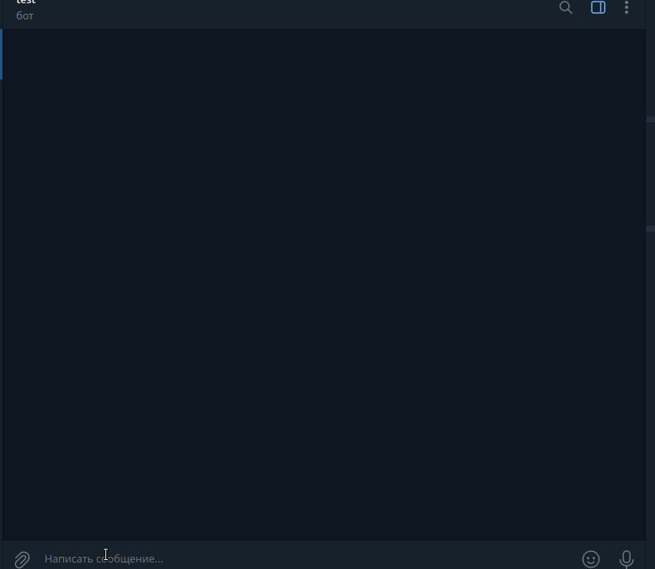
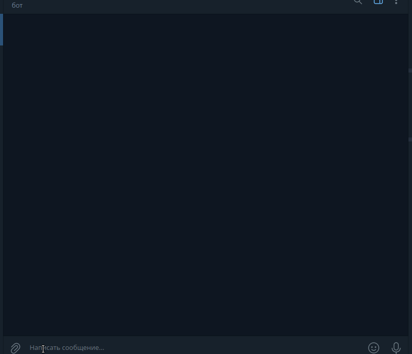

# Telegram Mini Apps for geo-positioning of places with garbage

## Installation

```bash
# clone the repository
https://github.com/o5b/...git
cd project-folder/
# install and activate the virtual environment
python3.12 -m venv venv
source venv/bin/activate
# insatll requirements
pip install -r requirements/base.txt
```

## Preparation before Use

Before running, you need to create the .env settings file.

```bash
# create settings file
cp .env.example .env
```

You need to specify your token for accessing the Telegram API.

- Create a bot via BotFather on Telegram and obtain the token for your bot.

Example `.env`:

```bash
TELEGRAM_BOT_TOKEN='your-telegram-bot-token'

POSTGRES_USER=geoapps
POSTGRES_PASSWORD=geoapps
POSTGRES_DB=geoapps
POSTGRES_HOST=postgres
POSTGRES_PORT=5432

GUNICORN_PORT=8000
GUNICORN_WORKERS=2
GUNICORN_TIMEOUT=60
GUNICORN_LOG_LEVEL=info

DJANGO_SECRET_KEY='your-django-secure-key'
DJANGO_DEBUG=0
# DJANGO_ALLOWED_HOSTS=127.0.0.1,localhost
DJANGO_LANGUAGE_CODE=en-us
DJANGO_TIME_ZONE=UTC
DJANGO_CSRF_TRUSTED_ORIGINS=
DJANGO_EMAIL_HOST=localhost
DJANGO_EMAIL_PORT=25
DJANGO_EMAIL_HOST_USER=
DJANGO_EMAIL_HOST_PASSWORD=
# DJANGO_EMAIL_USE_TLS=false
DJANGO_SERVER_EMAIL=root@localhost
DJANGO_DEFAULT_FROM_EMAIL=webmaster@localhost
DJANGO_ADMIN_NAME=
DJANGO_ADMIN_EMAIL=
DJANGO_SUPERUSER_USERNAME=admin
DJANGO_SUPERUSER_PASSWORD=django_superuser_password
DJANGO_SUPERUSER_EMAIL=admin@example.com
```

## Preparation Django

```bash
cd project-folder/
# if not activated yet, then activate the virtual environment
source venv/bin/activate
python manage.py makemigrations
python manage.py migrate
python manage.py createsuperuser
python manage.py collectstatic
```

### Running Django

```bash
cd project-folder/
# if not activated yet, then activate the virtual environment
source venv/bin/activate
python -m uvicorn --reload settings.asgi:application
```

Now you can login to the admin site: http://127.0.0.1:8000/admin/

### Running a Telegram Mini Apps

Run the telegram bot in another console

```bash
cd project-folder/
# if not activated yet, then activate the virtual environment
source venv/bin/activate
python bot.py
```

Now you can open the application in telegram.

### Django-modeltranslation

#### Synchronizing Model Fields

```
python manage.py sync_translation_fields
```

#### If you need to transfer the data that was originally in the model to the fields created by django-modeltranslation

```
python manage.py update_translation_fields
```

### Add test data to the database

```
python manage.py loaddata fixtures/db.json
```

#### If you need to save data from the database to fixtures

```
python manage.py dumpdata capture main services --indent 2 > fixtures/db.json
```
## Demo

Map



Settings



Site


Приложение в процессе разработки. Состояние видно на демо.
